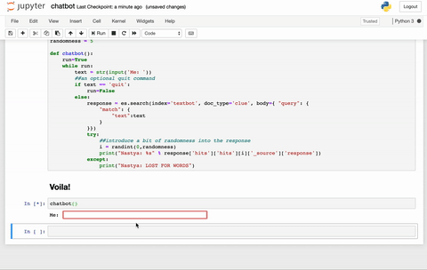

# Nastya Chatbot

__Update__: Version 2.0 is out! Newer, bigger, and cleaner data.

Main chatbot can be found at [chatbot.ipynb](https://github.com/karkipra/AI-Fun/blob/master/NastyaChatbot/chatbot.ipynb).

## Details

My main motivation for this project stems from wanting to learn more about Natural Language Procession and Machine Learning applications based on my own internet footprints. Hence, I used my [Facebook information](https://www.facebook.com/help/1701730696756992?helpref=hc_global_nav) to get a lot of messages and transformed them into a workable chatbot - Nastya.

The main principle of the chatbot was TF-IDF, aided greatly by [Elasticsearch](https://www.elastic.co/what-is/elasticsearch) and [Bulk API](https://developer.salesforce.com/docs/atlas.en-us.api_asynch.meta/api_asynch/asynch_api_intro.htm). 

.

## Details

My main motivation for this project stems from wanting to learn more about Natural Language Procession and Machine Learning applications based on my own internet footprints. Hence, I used my [Facebook information](https://www.facebook.com/help/1701730696756992?helpref=hc_global_nav) to get a lot of messages and transformed them into a workable chatbot - Nastya.

The main principle of the chatbot was TF-IDF, aided greatly by [Elasticsearch](https://www.elastic.co/what-is/elasticsearch) and [Bulk API](https://developer.salesforce.com/docs/atlas.en-us.api_asynch.meta/api_asynch/asynch_api_intro.htm). 


## Demo



## Code sample

Below is my implementation of the chatbot function (of course preceded by a lot of data processing)

```
# Randomness indictator for the chatbot
randomness = 10

def chatbot():
    run=True
    while run:
        text = str(input('Me: '))
        ##an optional quit command
        if text == 'quit':
            run=False
        else:
            response = es.search(index='textbot', doc_type='clue', body={ "query": {
                "match": {
                    "text":text
                }
            }})
            try:
                ##introduce a bit of randomness into the response 
                i = randint(0,randomness)
                print("Nastya: %s" % response['hits']['hits'][i]['_source']['response'])
            except:
                print("Nastya: LOST FOR WORDS")
```

## References

- https://towardsdatascience.com/how-to-build-an-easy-quick-and-essentially-useless-chatbot-using-your-own-text-messages-f2cb8b84c11d

## Updates

- Incorporate audio messages and facebook comments
- Wrinkled out some issues with the randomness of the 
]()

## Demo

## Code sample

Below is my implementation of the chatbot function (of course preceded by a lot of data processing)

```
# Randomness indictator for the chatbot
randomness = 10

def chatbot():
    run=True
    while run:
        text = str(input('Me: '))
        ##an optional quit command
        if text == 'quit':
            run=False
        else:
            response = es.search(index='textbot', doc_type='clue', body={ "query": {
                "match": {
                    "text":text
                }
            }})
            try:
                ##introduce a bit of randomness into the response 
                i = randint(0,randomness)
                print("Nastya: %s" % response['hits']['hits'][i]['_source']['response'])
            except:
                print("Nastya: LOST FOR WORDS")
```

## References

- https://towardsdatascience.com/how-to-build-an-easy-quick-and-essentially-useless-chatbot-using-your-own-text-messages-f2cb8b84c11d

## Updates

- Incorporate audio messages and facebook comments
- Wrinkled out some issues with the randomness of the 
