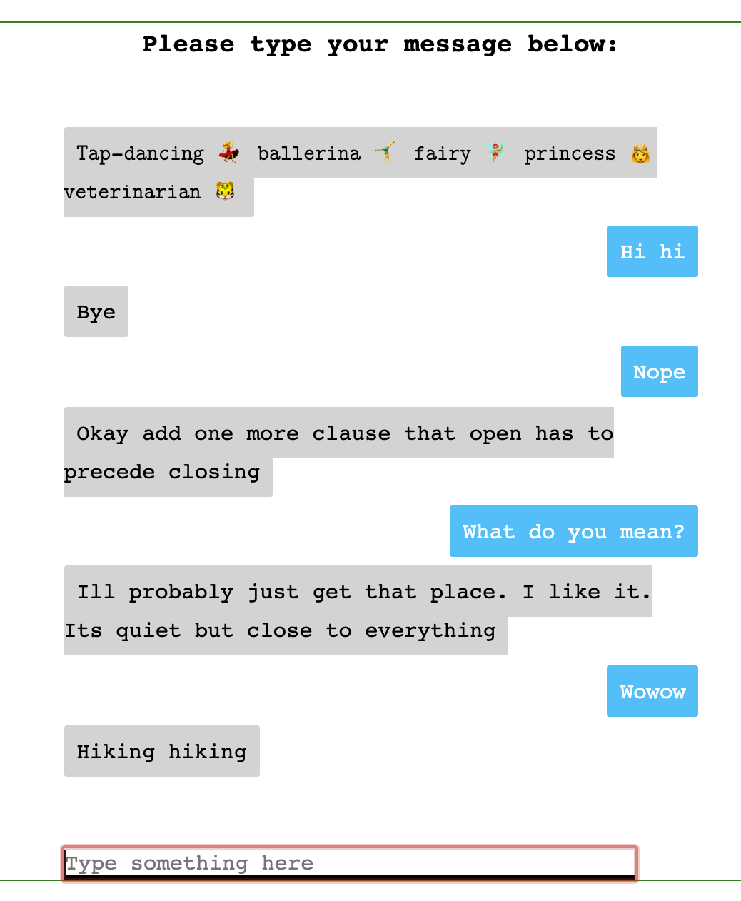

# Nastya Chatbot

__Update__: Version 3.0 makes the chatbot compatible with Heroku! However, the Heroku add-on doesn't allow much data usage in their free mode hehe so I'm sticking to local development for now. Stay tuned! 

__Update__: Version 2.0 is out! Newer, bigger, and cleaner data.

Main chatbot can be found at [chatbot.ipynb](https://github.com/karkipra/AI-Fun/blob/master/NastyaChatbot/chatbot.ipynb).

## Details

My main motivation for this project stems from wanting to learn more about Natural Language Procession and Machine Learning applications based on my own internet footprints. Hence, I used my [Facebook information](https://www.facebook.com/help/1701730696756992?helpref=hc_global_nav) to get a lot of messages and transformed them into a workable chatbot - Nastya.

The main principle of the chatbot was TF-IDF, aided greatly by [Elasticsearch](https://www.elastic.co/what-is/elasticsearch) and [Bulk API](https://developer.salesforce.com/docs/atlas.en-us.api_asynch.meta/api_asynch/asynch_api_intro.htm). 


Source: Wikipedias

All the data was processed in Jupyter Notebook. Please refer to `data_prep.ipynb` and `chatbot.ipynb` for details on data processing.

## Demo



## Installation

The application can be installed in a few easy steps. First, clone the repository:

`git clone https://github.com/karkipra/AI-Fun.git`

The app is located within a subdirectory of this project so lets `cd` into it:

`cd NastyaChatbot`

Now we want the libraries and modules that are used by the app to be installed. If you have `pip`, it's a piece of cake.
 
 ```
pip install elasticsearch
pip install pickle     
``` 

The `templates` directory contains `home.html` which you can modify to change the look of the app. `app.py` is where the main meat of the application lies. Please refer to that file if you wish to learn more about how the app works. 

Finally, to run the app:

`python app.py`

Open the app on http://127.0.0.1:5000/ and Voila!

## References

- https://towardsdatascience.com/how-to-build-an-easy-quick-and-essentially-useless-chatbot-using-your-own-text-messages-f2cb8b84c11d
- https://devcenter.heroku.com/articles/bonsai
- https://docs.bonsai.io/article/94-connecting-to-bonsai

## Future Updates

- Incorporate audio messages and facebook comments
- Wrinkle out some issues with the randomness of the responses
- Fix issue with Bonsai Add-on data usage and deploy it successfully
    - Possibly use a database like SQLite to save memory 

